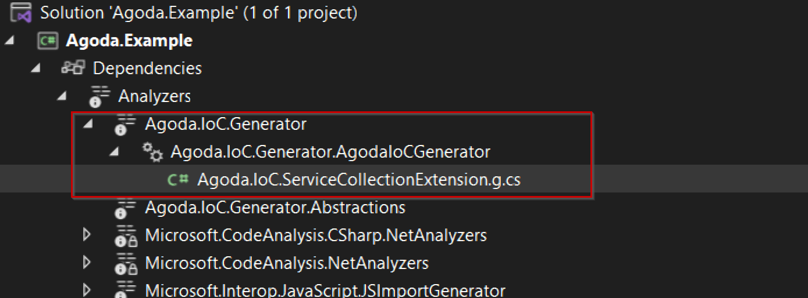

# Installation

## Add the NuGet Package to your project

All you need to do, to install Agoda.Ioc.Generator is to add a NuGet reference pointing to the package Agoda.Ioc.Generator.

## PackageReference

``` xml
<PackageReference Include="Agoda.Ioc.Generator" Version="version"   />
```

## .NET CLI

``` powershell
dotnet add package Agoda.Ioc.Generator 
```

**Note:** if you don't need a transitive dependency.please add PrivateAssets="all" on PackageReference Include="Agoda.Ioc.Generator" Version="xxx" />
example
``` xml
<PackageReference Include="Agoda.Ioc.Generator" Version="version" PrivateAssets="all" />
```

## Usage in your project

The basic usage of this project allows you to use 3 core attributes on your classes (RegisterTransient, RegisterScoped, RegisterSingleton) like the following code:

```csharp
    // Project namespace is Agoda.Example
    public interface IService {}
    [RegisterSingleton] 
    public class Service : IService {}
```

In above example the generator will emit below code

```csharp
services.AddSingleton<IService, Service>();
```

When your project is being built, the library will scan your source code during compilation and emit an extension method with the name `RegisterFromYour<assembly name without the dot>`, in this case `RegisterFromAgodaExample`.Project analyzers contain the complete source code.



```csharp
// <auto-generated>
//     Automatically generated by Agoda.IoC.Generator.
//     Changes made to this file may be lost and may cause undesirable behavior.
// </auto-generated>
using Microsoft.Extensions.DependencyInjection.Extensions;
using Agoda.Example;

namespace Microsoft.Extensions.DependencyInjection
{
    public static class AgodaIoCGeneratorInjectServiceCollectionExtension
    {
        public static IServiceCollection RegisterFromAgodaExample(this IServiceCollection serviceCollection)
        {
            return Register(serviceCollection);
        }

        internal static IServiceCollection Register(this IServiceCollection serviceCollection)
        {
 serviceCollection.AddSingleton<IService, Service>;
            return serviceCollection;
        }
    }
}
```
Factory options are available for registration with the attributes, as seen below, the factory needs a "Factory" method and Factory class should implement the interface called `IImplementationFactory<of your targer type>`

Let's examine one example.

```csharp
using Agoda.IoC.Generator.Abstractions;

namespace Agoda.Example;

public interface ICustomerService { }

[RegisterSingleton(Factory = typeof(CustomerServiceFactory))]
public class CustomerService : ICustomerService
{
}

// Factory class
public class CustomerServiceFactory : IImplementationFactory<ICustomerService>
{
    public ICustomerService Factory(IServiceProvider serviceProvider)
    {
        // more code here
        // serviceProvider.GetService(typeof(AccoutService));
        return new CustomerService();
    }
}
```

Project analyzers contain the complete source code.

```csharp
// <auto-generated>
//     Automatically generated by Agoda.IoC.Generator.
//     Changes made to this file may be lost and may cause undesirable behavior.
// </auto-generated>
using Microsoft.Extensions.DependencyInjection.Extensions;
using Agoda.Example;

namespace Microsoft.Extensions.DependencyInjection
{
    public static class AgodaIoCGeneratorInjectServiceCollectionExtension
    {
        public static IServiceCollection RegisterFromAgodaExample(this IServiceCollection serviceCollection)
        {
            return Register(serviceCollection);
        }

        internal static IServiceCollection Register(this IServiceCollection serviceCollection)
        {
            serviceCollection.AddSingleton<IService, Service>();
            serviceCollection.AddSingleton(sp => new CustomerServiceFactory().Factory(sp));
            return serviceCollection;
        }
    }
}
```

For services with multiple interfaces the interface can be explicitly declared like below

``` csharp
// This class implements 2 interfaces, but we explicitly tell it to register only 1.
[RegisterTransient(For = typeof(IExplicitlyRegisteredInterface))]
public class ServiceWithExplicitInterfaceRegistration : IExplicitlyRegisteredInterface, IInterfaceThatShouldNotGetRegistered {}
```
It can also be used to register multiple instances

``` csharp
[RegisterSingleton(For = typeof(IMultipleAttributes1))]
[RegisterSingleton(For = typeof(IMultipleAttributes2))]
public class MultipleAttributes : IMultipleAttributes1, IMultipleAttributes2 {}
```

Additionally, it may be used to assign an attribute order and register many instances as a collection.

``` csharp
using Agoda.IoC.Generator.Abstractions;

namespace Agoda.Example;

public interface IPipeline
{
    string Invoke();
}

[RegisterSingleton(For = typeof(IPipeline), OfCollection = true, Order = 2)]
public class Pipeline2 : IPipeline
{
    public string Invoke()
    {
        return nameof(Pipeline2);
    }
}
[RegisterSingleton(For = typeof(IPipeline), OfCollection = true, Order = 3)]
public class Pipeline3 : IPipeline
{
    public string Invoke()
    {
        return nameof(Pipeline2);
    }
}
[RegisterSingleton(For = typeof(IPipeline), OfCollection = true, Order = 1)]
public class Pipeline1 : IPipeline
{
    public string Invoke()
    {
        return nameof(Pipeline1);
    }
}
```

Project analyzers contain the complete source code.

``` csharp
// <auto-generated>
//     Automatically generated by Agoda.IoC.Generator.
//     Changes made to this file may be lost and may cause undesirable behavior.
// </auto-generated>
using Microsoft.Extensions.DependencyInjection.Extensions;
using Agoda.Example;

namespace Microsoft.Extensions.DependencyInjection
{
    public static class AgodaIoCGeneratorInjectServiceCollectionExtension
    {
        public static IServiceCollection RegisterFromAgodaExample(this IServiceCollection serviceCollection)
        {
            return Register(serviceCollection);
        }

        internal static IServiceCollection Register(this IServiceCollection serviceCollection)
        {
            serviceCollection.AddSingleton<IService, Service>();
            serviceCollection.AddSingleton(sp => new CustomerServiceFactory().Factory(sp));
            // Of Collection code
            serviceCollection.AddSingleton<IPipeline, Pipeline1>();
            serviceCollection.AddSingleton<IPipeline, Pipeline2>();
            serviceCollection.AddSingleton<IPipeline, Pipeline3>();

            return serviceCollection;
        }
    }
}
```


It can also be used to register open generic

``` csharp
using Agoda.IoC.Generator.Abstractions;

namespace Agoda.Example;

[RegisterSingleton(For = typeof(IDoWork<>))]
public class GenericDoWork<T> : IDoWork<T> where T : new()
{

    public T Process()
    {
        return new T();
    }
}
public interface IDoWork<T> where T : new()
{
    T Process();
}
```

Project analyzers contain the complete source code.

``` csharp 
// <auto-generated>
//     Automatically generated by Agoda.IoC.Generator.
//     Changes made to this file may be lost and may cause undesirable behavior.
// </auto-generated>
using Microsoft.Extensions.DependencyInjection.Extensions;
using Agoda.Example;

namespace Microsoft.Extensions.DependencyInjection
{
    public static class AgodaIoCGeneratorInjectServiceCollectionExtension
    {
        public static IServiceCollection RegisterFromAgodaExample(this IServiceCollection serviceCollection)
        {
            return Register(serviceCollection);
        }

        internal static IServiceCollection Register(this IServiceCollection serviceCollection)
        {
            serviceCollection.AddSingleton<IService, Service>();
            serviceCollection.AddSingleton(sp => new CustomerServiceFactory().Factory(sp));
            serviceCollection.AddSingleton(typeof(IDoWork<>),typeof(GenericDoWork<>)); // <=== Here
            // Of Collection code
            serviceCollection.AddSingleton<IPipeline, Pipeline1>();
            serviceCollection.AddSingleton<IPipeline, Pipeline2>();
            serviceCollection.AddSingleton<IPipeline, Pipeline3>();

            return serviceCollection;
        }
    }
```

`ReplaceService = true` is a parameter that can be specified on the register property when it becomes necessary to replace a service with a mock version or a new implementation.

``` csharp
using Agoda.IoC.Generator.Abstractions;

namespace Agoda.Example;

// Old
public interface IService { }
[RegisterSingleton]
public class Service : IService { }


//New
[RegisterSingleton(ReplaceService = true)]
public class NewService : IService { }
```

Project analyzers contain the complete source code.
``` csharp
// <auto-generated>
//     Automatically generated by Agoda.IoC.Generator.
//     Changes made to this file may be lost and may cause undesirable behavior.
// </auto-generated>
using Microsoft.Extensions.DependencyInjection.Extensions;
using Agoda.Example;

namespace Microsoft.Extensions.DependencyInjection
{
    public static class AgodaIoCGeneratorInjectServiceCollectionExtension
    {
        public static IServiceCollection RegisterFromAgodaExample(this IServiceCollection serviceCollection)
        {
            return Register(serviceCollection);
        }

        internal static IServiceCollection Register(this IServiceCollection serviceCollection)
        {
            serviceCollection.AddSingleton<IService, Service>();
            serviceCollection.Replace(new ServiceDescriptor(typeof(NewService), ServiceLifetime.Singleton)); // <=== HERE
            serviceCollection.AddSingleton(sp => new CustomerServiceFactory().Factory(sp));
            serviceCollection.AddSingleton(typeof(IDoWork<>),typeof(GenericDoWork<>));
            // Of Collection code
            serviceCollection.AddSingleton<IPipeline, Pipeline1>();
            serviceCollection.AddSingleton<IPipeline, Pipeline2>();
            serviceCollection.AddSingleton<IPipeline, Pipeline3>();

            return serviceCollection;
        }
    }
}
```


# Final step

You just need to call extension method in entry project like this

``` csharp
var builder = WebApplication.CreateBuilder(args);
...
builder.Services.RegisterFromAgodaExample(); // Here 😃
var app = builder.Build();
...
app.Run();
```

Enjoy coding 😃